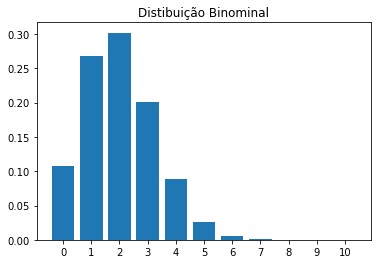
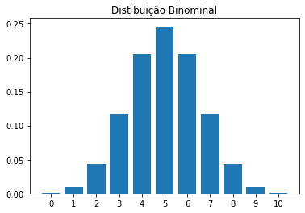
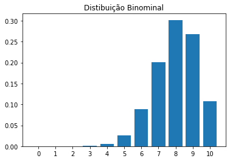
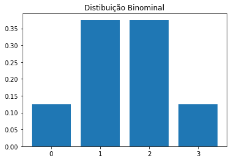
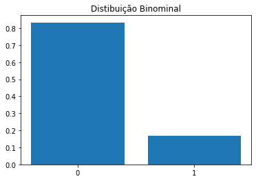
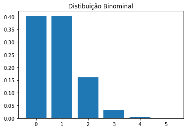

# DISTRIBUIÇÃO BINOMIAL

A distribuição binomial é uma distribuição de probabilidade que resume a probabilidade de uma variável assumir um de dois valores independentes sob um determinado conjunto de parâmetros. A distribuição é obtida executando uma série de testes de Bernoulli .


```python
import scipy
from scipy.stats import binom 
import pandas as pd
import numpy as np

import matplotlib.pyplot as plt
```


```python
# Versões dos módulos

!python --version
%reload_ext watermark
%watermark --iversions
```

```
Python 3.9.7
pandas    : 1.3.4
matplotlib: 3.4.3
scipy     : 1.7.1
numpy     : 1.20.3

```


```python
def grafico(x_, probabilidades):
    """FUNÇÃO PARA CRIAR GRÁFICO"""
    
    fig, ax = plt.subplots()
    plt.title('Distibuição Binominal')
    plt.bar(x_, probabilidades)
    plt.xticks(x_)
    plt.show()
```


```python
def distribuicao_binomial(p, n):
    """FUNÇÃO PARA GERAR A DISTRIBUIÇÃO BINOMIAL"""
    
    # Frequências
    x_ = list(range(n +1))
    
    # Probabilidades
    probabilidades = [binom.pmf(vl, n, p) for vl in x_]
    
    # Cálculos estatísticos
    mean, var = binom.stats(n, p)
    mean = float(mean)
    var = float(var)
    dp = np.sqrt(var)
    
    # Tabela de probabilidades
    tb = pd.DataFrame()
    tb['x'] = x_
    tb['P(x)'] = probabilidades
    
    return tb, mean, var, dp
```


```python
def analise_binomial(p, n, arrendondar = 4):
    
    tb, mean, var, dp = distribuicao_binomial(p, n)
    
    print('Média', round(mean, arrendondar))
    print('Variância', round(var, arrendondar))
    print('Desvio Padrão', round(dp, arrendondar))
    
    grafico(tb['x'], tb['P(x)'])
    
    tb['P(x)'] = tb['P(x)'].apply(lambda x: round(x, arrendondar))
    
    return tb
```


# CURIOSIDADE


```python
tb = analise_binomial(0.2, 10)
```

```
Média 2.0
Variância 1.6
Desvio Padrão 1.2649
```





```python
tb = analise_binomial(0.5, 10)
```

```
Média 5.0
Variância 2.5
Desvio Padrão 1.5811
```





```python
tb = analise_binomial(0.8, 10)
```

```
Média 8.0
Variância 1.6
Desvio Padrão 1.2649
```





# EXEMPLOS


## 1º Problema

Lançando uma moeda 3 vezes qual é a probabilidade de conseguir tirar duas caras


```python
tb = analise_binomial(0.5, 3)
tb
```

```
Média 1.5
Variância 0.75
Desvio Padrão 0.866
```





<div>

<table border="1" class="dataframe">
  <thead>
    <tr style="text-align: right;">
      <th></th>
      <th>x</th>
      <th>P(x)</th>
    </tr>
  </thead>
  <tbody>
    <tr>
      <th>0</th>
      <td>0</td>
      <td>0.125</td>
    </tr>
    <tr>
      <th>1</th>
      <td>1</td>
      <td>0.375</td>
    </tr>
    <tr>
      <th>2</th>
      <td>2</td>
      <td>0.375</td>
    </tr>
    <tr>
      <th>3</th>
      <td>3</td>
      <td>0.125</td>
    </tr>
  </tbody>
</table>
</div>


## 2º Problema

Lançando uma moeda 10 vezes qual é a probabilidade de conseguir tirar duas caras


```python
tb = analise_binomial(0.5, 10)
tb
```

```
Média 5.0
Variância 2.5
Desvio Padrão 1.5811
```


<div>

<table border="1" class="dataframe">
  <thead>
    <tr style="text-align: right;">
      <th></th>
      <th>x</th>
      <th>P(x)</th>
    </tr>
  </thead>
  <tbody>
    <tr>
      <th>0</th>
      <td>0</td>
      <td>0.0010</td>
    </tr>
    <tr>
      <th>1</th>
      <td>1</td>
      <td>0.0098</td>
    </tr>
    <tr>
      <th>2</th>
      <td>2</td>
      <td>0.0439</td>
    </tr>
    <tr>
      <th>3</th>
      <td>3</td>
      <td>0.1172</td>
    </tr>
    <tr>
      <th>4</th>
      <td>4</td>
      <td>0.2051</td>
    </tr>
    <tr>
      <th>5</th>
      <td>5</td>
      <td>0.2461</td>
    </tr>
    <tr>
      <th>6</th>
      <td>6</td>
      <td>0.2051</td>
    </tr>
    <tr>
      <th>7</th>
      <td>7</td>
      <td>0.1172</td>
    </tr>
    <tr>
      <th>8</th>
      <td>8</td>
      <td>0.0439</td>
    </tr>
    <tr>
      <th>9</th>
      <td>9</td>
      <td>0.0098</td>
    </tr>
    <tr>
      <th>10</th>
      <td>10</td>
      <td>0.0010</td>
    </tr>
  </tbody>
</table>
</div>


## 3º Problema

Lançando um dado 1 vez qual a probabilidade de conseguir tirar o número 1


```python
tb = analise_binomial(1/6, 1)
tb
```

```
Média 0.1667
Variância 0.1389
Desvio Padrão 0.3727
```





<div>

<table border="1" class="dataframe">
  <thead>
    <tr style="text-align: right;">
      <th></th>
      <th>x</th>
      <th>P(x)</th>
    </tr>
  </thead>
  <tbody>
    <tr>
      <th>0</th>
      <td>0</td>
      <td>0.8333</td>
    </tr>
    <tr>
      <th>1</th>
      <td>1</td>
      <td>0.1667</td>
    </tr>
  </tbody>
</table>
</div>


## 4º Problema

Lançando um dado 5 vez qual a probabilidade de conseguir tirar o número 1


```python
tb = analise_binomial(1/6, 5)
tb
```

```
Média 0.8333
Variância 0.6944
Desvio Padrão 0.8333
```





<div>

<table border="1" class="dataframe">
  <thead>
    <tr style="text-align: right;">
      <th></th>
      <th>x</th>
      <th>P(x)</th>
    </tr>
  </thead>
  <tbody>
    <tr>
      <th>0</th>
      <td>0</td>
      <td>0.4019</td>
    </tr>
    <tr>
      <th>1</th>
      <td>1</td>
      <td>0.4019</td>
    </tr>
    <tr>
      <th>2</th>
      <td>2</td>
      <td>0.1608</td>
    </tr>
    <tr>
      <th>3</th>
      <td>3</td>
      <td>0.0322</td>
    </tr>
    <tr>
      <th>4</th>
      <td>4</td>
      <td>0.0032</td>
    </tr>
    <tr>
      <th>5</th>
      <td>5</td>
      <td>0.0001</td>
    </tr>
  </tbody>
</table>
</div>


## 5º Problema

Lançando um dado 5 vez qual a probabilidade de conseguir tirar o número 1, 3 vezes


```python
tb = analise_binomial(1/6, 5)
tb
```

```
Média 0.8333
Variância 0.6944
Desvio Padrão 0.8333
```


<div>

<table border="1" class="dataframe">
  <thead>
    <tr style="text-align: right;">
      <th></th>
      <th>x</th>
      <th>P(x)</th>
    </tr>
  </thead>
  <tbody>
    <tr>
      <th>0</th>
      <td>0</td>
      <td>0.4019</td>
    </tr>
    <tr>
      <th>1</th>
      <td>1</td>
      <td>0.4019</td>
    </tr>
    <tr>
      <th>2</th>
      <td>2</td>
      <td>0.1608</td>
    </tr>
    <tr>
      <th>3</th>
      <td>3</td>
      <td>0.0322</td>
    </tr>
    <tr>
      <th>4</th>
      <td>4</td>
      <td>0.0032</td>
    </tr>
    <tr>
      <th>5</th>
      <td>5</td>
      <td>0.0001</td>
    </tr>
  </tbody>
</table>
</div>


# CÁLCULO DO VARIÂNCIA E DESVIO PADRÃO


```python
tb = analise_binomial(1/6, 5)
tb
```

```
Média 0.8333
Variância 0.6944
Desvio Padrão 0.8333
```


<div>

<table border="1" class="dataframe">
  <thead>
    <tr style="text-align: right;">
      <th></th>
      <th>x</th>
      <th>P(x)</th>
    </tr>
  </thead>
  <tbody>
    <tr>
      <th>0</th>
      <td>0</td>
      <td>0.4019</td>
    </tr>
    <tr>
      <th>1</th>
      <td>1</td>
      <td>0.4019</td>
    </tr>
    <tr>
      <th>2</th>
      <td>2</td>
      <td>0.1608</td>
    </tr>
    <tr>
      <th>3</th>
      <td>3</td>
      <td>0.0322</td>
    </tr>
    <tr>
      <th>4</th>
      <td>4</td>
      <td>0.0032</td>
    </tr>
    <tr>
      <th>5</th>
      <td>5</td>
      <td>0.0001</td>
    </tr>
  </tbody>
</table>
</div>


```python
# MÉDIA M = N.P

5 * (1/6)
```


```python
# VARIÂNCIA o^2 = np(1-p)

5 * (1/6) * (1 - (1/6))
```


```python
# DESVIO PADRÃO dp = (o^2)^0.5

(5 * (1/6) * (1 - (1/6))) ** 0.5
```

