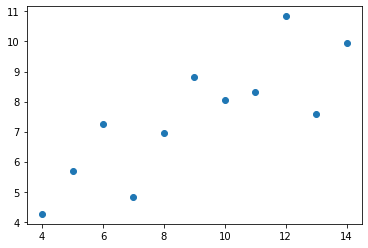
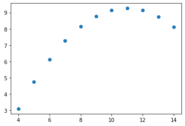
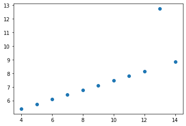
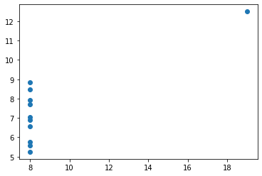
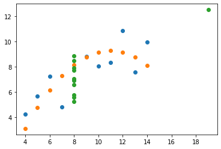

# Quarteto de Anscombe


```python
# Importar módulos

import pandas as pd
import numpy as np

import matplotlib
import matplotlib.pyplot as plt
```


```python
# Versões dos módulos

!python --version
%reload_ext watermark
%watermark --iversions
```


<pre>
Python 3.9.7
pandas    : 1.3.4
matplotlib: 3.4.3
numpy     : 1.20.3

</pre>


```python
# Valores do quarteto de anscombe

dadostxt = """I	II	III	IV
x	y	x	y	x	y	x	y
10,0	8,04	10,0	9,14	10,0	7,46	8,0	6,58
8,0	6,95	8,0	8,14	8,0	6,77	8,0	5,76
13,0	7,58	13,0	8,74	13,0	12,74	8,0	7,71
9,0	8,81	9,0	8,77	9,0	7,11	8,0	8,84
11,0	8,33	11,0	9,26	11,0	7,81	8,0	8,47
14,0	9,96	14,0	8,10	14,0	8,84	8,0	7,04
6,0	7,24	6,0	6,13	6,0	6,08	8,0	5,25
4,0	4,26	4,0	3,10	4,0	5,39	19,0	12,50
12,0	10,84	12,0	9,13	12,0	8,15	8,0	5,56
7,0	4,82	7,0	7,26	7,0	6,42	8,0	7,91
5,0	5,68	5,0	4,74	5,0	5,73	8,0	6,89""".replace(',', '.')

dados = [vl.split() for vl in dadostxt.split('\n')]
```


```python
# Criar dataset

dados = pd.DataFrame(dados[2:])
```


```python
# Transformar os valores em float

for cl in dados.columns:
  dados[cl] = dados[cl].apply(float)
```


```python
# Vivualizar os dados

dados
```


<div>

<table border="1" class="dataframe">
  <thead>
    <tr style="text-align: right;">
      <th></th>
      <th>0</th>
      <th>1</th>
      <th>2</th>
      <th>3</th>
      <th>4</th>
      <th>5</th>
      <th>6</th>
      <th>7</th>
    </tr>
  </thead>
  <tbody>
    <tr>
      <th>0</th>
      <td>10.0</td>
      <td>8.04</td>
      <td>10.0</td>
      <td>9.14</td>
      <td>10.0</td>
      <td>7.46</td>
      <td>8.0</td>
      <td>6.58</td>
    </tr>
    <tr>
      <th>1</th>
      <td>8.0</td>
      <td>6.95</td>
      <td>8.0</td>
      <td>8.14</td>
      <td>8.0</td>
      <td>6.77</td>
      <td>8.0</td>
      <td>5.76</td>
    </tr>
    <tr>
      <th>2</th>
      <td>13.0</td>
      <td>7.58</td>
      <td>13.0</td>
      <td>8.74</td>
      <td>13.0</td>
      <td>12.74</td>
      <td>8.0</td>
      <td>7.71</td>
    </tr>
    <tr>
      <th>3</th>
      <td>9.0</td>
      <td>8.81</td>
      <td>9.0</td>
      <td>8.77</td>
      <td>9.0</td>
      <td>7.11</td>
      <td>8.0</td>
      <td>8.84</td>
    </tr>
    <tr>
      <th>4</th>
      <td>11.0</td>
      <td>8.33</td>
      <td>11.0</td>
      <td>9.26</td>
      <td>11.0</td>
      <td>7.81</td>
      <td>8.0</td>
      <td>8.47</td>
    </tr>
    <tr>
      <th>5</th>
      <td>14.0</td>
      <td>9.96</td>
      <td>14.0</td>
      <td>8.10</td>
      <td>14.0</td>
      <td>8.84</td>
      <td>8.0</td>
      <td>7.04</td>
    </tr>
    <tr>
      <th>6</th>
      <td>6.0</td>
      <td>7.24</td>
      <td>6.0</td>
      <td>6.13</td>
      <td>6.0</td>
      <td>6.08</td>
      <td>8.0</td>
      <td>5.25</td>
    </tr>
    <tr>
      <th>7</th>
      <td>4.0</td>
      <td>4.26</td>
      <td>4.0</td>
      <td>3.10</td>
      <td>4.0</td>
      <td>5.39</td>
      <td>19.0</td>
      <td>12.50</td>
    </tr>
    <tr>
      <th>8</th>
      <td>12.0</td>
      <td>10.84</td>
      <td>12.0</td>
      <td>9.13</td>
      <td>12.0</td>
      <td>8.15</td>
      <td>8.0</td>
      <td>5.56</td>
    </tr>
    <tr>
      <th>9</th>
      <td>7.0</td>
      <td>4.82</td>
      <td>7.0</td>
      <td>7.26</td>
      <td>7.0</td>
      <td>6.42</td>
      <td>8.0</td>
      <td>7.91</td>
    </tr>
    <tr>
      <th>10</th>
      <td>5.0</td>
      <td>5.68</td>
      <td>5.0</td>
      <td>4.74</td>
      <td>5.0</td>
      <td>5.73</td>
      <td>8.0</td>
      <td>6.89</td>
    </tr>
  </tbody>
</table>
</div>


```python
# Verificar os dados do dataset

dados.describe()
```


<div>

<table border="1" class="dataframe">
  <thead>
    <tr style="text-align: right;">
      <th></th>
      <th>0</th>
      <th>1</th>
      <th>2</th>
      <th>3</th>
      <th>4</th>
      <th>5</th>
      <th>6</th>
      <th>7</th>
    </tr>
  </thead>
  <tbody>
    <tr>
      <th>count</th>
      <td>11.000000</td>
      <td>11.000000</td>
      <td>11.000000</td>
      <td>11.000000</td>
      <td>11.000000</td>
      <td>11.000000</td>
      <td>11.000000</td>
      <td>11.000000</td>
    </tr>
    <tr>
      <th>mean</th>
      <td>9.000000</td>
      <td>7.500909</td>
      <td>9.000000</td>
      <td>7.500909</td>
      <td>9.000000</td>
      <td>7.500000</td>
      <td>9.000000</td>
      <td>7.500909</td>
    </tr>
    <tr>
      <th>std</th>
      <td>3.316625</td>
      <td>2.031568</td>
      <td>3.316625</td>
      <td>2.031657</td>
      <td>3.316625</td>
      <td>2.030424</td>
      <td>3.316625</td>
      <td>2.030579</td>
    </tr>
    <tr>
      <th>min</th>
      <td>4.000000</td>
      <td>4.260000</td>
      <td>4.000000</td>
      <td>3.100000</td>
      <td>4.000000</td>
      <td>5.390000</td>
      <td>8.000000</td>
      <td>5.250000</td>
    </tr>
    <tr>
      <th>25%</th>
      <td>6.500000</td>
      <td>6.315000</td>
      <td>6.500000</td>
      <td>6.695000</td>
      <td>6.500000</td>
      <td>6.250000</td>
      <td>8.000000</td>
      <td>6.170000</td>
    </tr>
    <tr>
      <th>50%</th>
      <td>9.000000</td>
      <td>7.580000</td>
      <td>9.000000</td>
      <td>8.140000</td>
      <td>9.000000</td>
      <td>7.110000</td>
      <td>8.000000</td>
      <td>7.040000</td>
    </tr>
    <tr>
      <th>75%</th>
      <td>11.500000</td>
      <td>8.570000</td>
      <td>11.500000</td>
      <td>8.950000</td>
      <td>11.500000</td>
      <td>7.980000</td>
      <td>8.000000</td>
      <td>8.190000</td>
    </tr>
    <tr>
      <th>max</th>
      <td>14.000000</td>
      <td>10.840000</td>
      <td>14.000000</td>
      <td>9.260000</td>
      <td>14.000000</td>
      <td>12.740000</td>
      <td>19.000000</td>
      <td>12.500000</td>
    </tr>
  </tbody>
</table>
</div>


```python
# Plotar os dados

plt.scatter(dados[0], dados[1])
```





```python
# Plotar os dados

plt.scatter(dados[2], dados[3])
```





```python
# Plotar os dados

plt.scatter(dados[4], dados[5])
```





```python
# Plotar os dados

plt.scatter(dados[6], dados[7])
```





```python
# Plotar os dados

plt.scatter(dados[0], dados[1])
plt.scatter(dados[2], dados[3])
plt.scatter(dados[6], dados[7])
```




