# STYLE PLOT


```python
# Importar módulos

import matplotlib.pyplot as plt
from matplotlib import style

contador = -1
```


```python
# Versões dos módulos

!python --version
%reload_ext watermark
%watermark --iversions
```

```
Python 3.9.7
matplotlib: 3.4.3

```


```python
# Print nos estilos

lista = plt.style.available
for vl in lista:
    print(vl, end=' ; ')
```

```
Solarize_Light2 ; _classic_test_patch ; bmh ; classic ; dark_background ; fast ; fivethirtyeight ; ggplot ; grayscale ; seaborn ; seaborn-bright ; seaborn-colorblind ; seaborn-dark ; seaborn-dark-palette ; seaborn-darkgrid ; seaborn-deep ; seaborn-muted ; seaborn-notebook ; seaborn-paper ; seaborn-pastel ; seaborn-poster ; seaborn-talk ; seaborn-ticks ; seaborn-white ; seaborn-whitegrid ; tableau-colorblind10 ; ```


```python
# Plotar exemplos

contador += 1
st = lista[contador]
print(st)
fig, ax = plt.subplots(figsize=(10, 3))
plt.style.use(st)
plt.plot([1, 2, 3])
plt.show()
```

```
Solarize_Light2
```


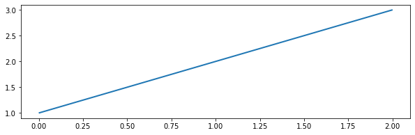


```python
contador += 1
st = lista[contador]
print(st)
fig, ax = plt.subplots(figsize=(10, 3))
plt.style.use(st)
plt.plot([1, 2, 3])
plt.show()
```

```
_classic_test_patch
```


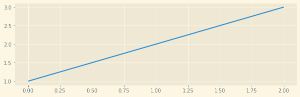


```python
contador += 1
st = lista[contador]
print(st)
fig, ax = plt.subplots(figsize=(10, 3))
plt.style.use(st)
plt.plot([1, 2, 3])
plt.show()
```

```
bmh
```


```python
contador += 1
st = lista[contador]
print(st)
fig, ax = plt.subplots(figsize=(10, 3))
plt.style.use(st)
plt.plot([1, 2, 3])
plt.show()
```

```
classic
```


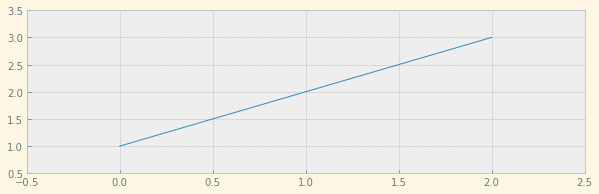


```python
contador += 1
st = lista[contador]
print(st)
fig, ax = plt.subplots(figsize=(10, 3))
plt.style.use(st)
plt.plot([1, 2, 3])
plt.show()
```

```
dark_background
```


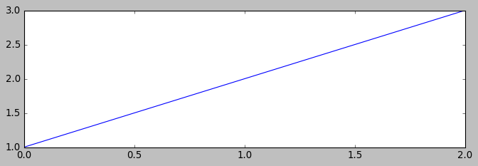


```python
contador += 1
st = lista[contador]
print(st)
fig, ax = plt.subplots(figsize=(10, 3))
plt.style.use(st)
plt.plot([1, 2, 3])
plt.show()
```

```
fast
```


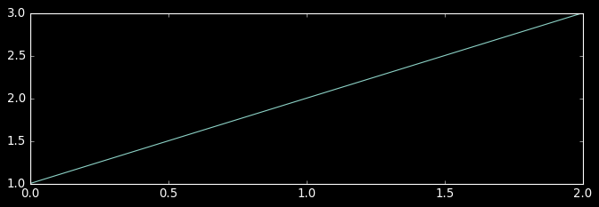


```python
contador += 1
st = lista[contador]
print(st)
fig, ax = plt.subplots(figsize=(10, 3))
plt.style.use(st)
plt.plot([1, 2, 3])
plt.show()
```

```
fivethirtyeight
```


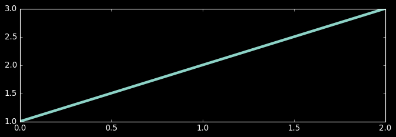


```python
contador += 1
st = lista[contador]
print(st)
fig, ax = plt.subplots(figsize=(10, 3))
plt.style.use(st)
plt.plot([1, 2, 3])
plt.show()
```

```
ggplot
```


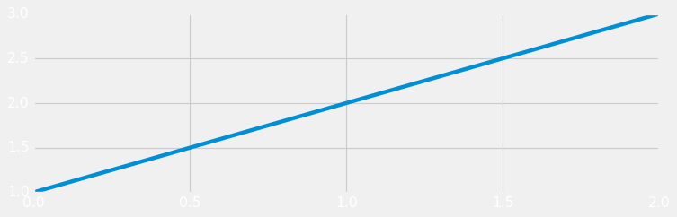


```python
contador += 1
st = lista[contador]
print(st)
fig, ax = plt.subplots(figsize=(10, 3))
plt.style.use(st)
plt.plot([1, 2, 3])
plt.show()
```

```
grayscale
```


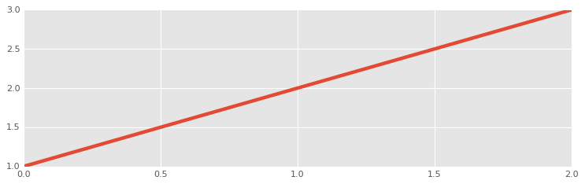


```python
contador += 1
st = lista[contador]
print(st)
fig, ax = plt.subplots(figsize=(10, 3))
plt.style.use(st)
plt.plot([1, 2, 3])
plt.show()
```

```
seaborn
```


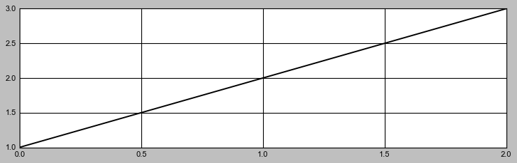


```python
contador += 1
st = lista[contador]
print(st)
fig, ax = plt.subplots(figsize=(10, 3))
plt.style.use(st)
plt.plot([1, 2, 3])
plt.show()
```

```
seaborn-bright
```


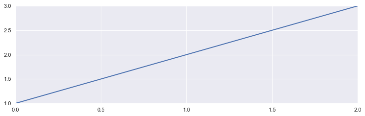


```python
contador += 1
st = lista[contador]
print(st)
fig, ax = plt.subplots(figsize=(10, 3))
plt.style.use(st)
plt.plot([1, 2, 3])
plt.show()
```

```
seaborn-colorblind
```


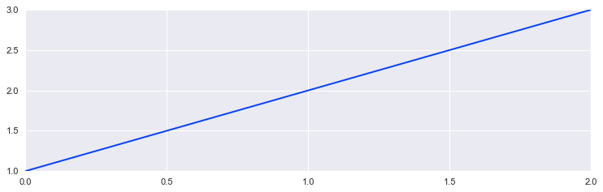


```python
contador += 1
st = lista[contador]
print(st)
fig, ax = plt.subplots(figsize=(10, 3))
plt.style.use(st)
plt.plot([1, 2, 3])
plt.show()
```

```
seaborn-dark
```


```python
contador += 1
st = lista[contador]
print(st)
fig, ax = plt.subplots(figsize=(10, 3))
plt.style.use(st)
plt.plot([1, 2, 3])
plt.show()
```

```
seaborn-dark-palette
```


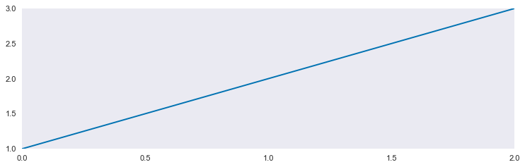


```python
contador += 1
st = lista[contador]
print(st)
fig, ax = plt.subplots(figsize=(10, 3))
plt.style.use(st)
plt.plot([1, 2, 3])
plt.show()
```

```
seaborn-darkgrid
```


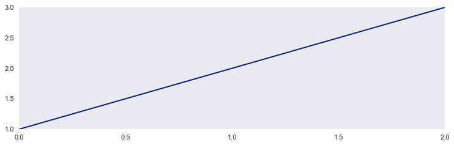


```python
contador += 1
st = lista[contador]
print(st)
fig, ax = plt.subplots(figsize=(10, 3))
plt.style.use(st)
plt.plot([1, 2, 3])
plt.show()
```

```
seaborn-deep
```


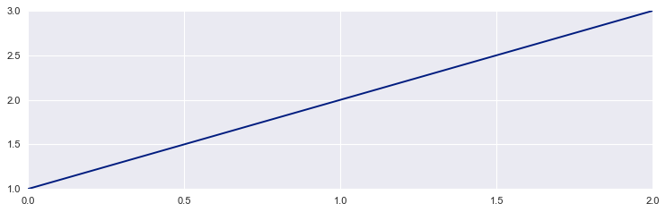


```python
contador += 1
st = lista[contador]
print(st)
fig, ax = plt.subplots(figsize=(10, 3))
plt.style.use(st)
plt.plot([1, 2, 3])
plt.show()
```

```
seaborn-muted
```


```python
contador += 1
st = lista[contador]
print(st)
fig, ax = plt.subplots(figsize=(10, 3))
plt.style.use(st)
plt.plot([1, 2, 3])
plt.show()
```

```
seaborn-notebook
```


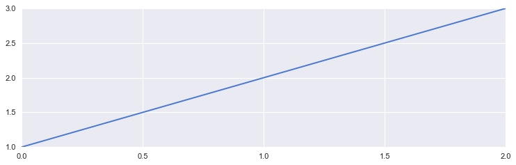


```python
contador += 1
st = lista[contador]
print(st)
fig, ax = plt.subplots(figsize=(10, 3))
plt.style.use(st)
plt.plot([1, 2, 3])
plt.show()
```

```
seaborn-paper
```


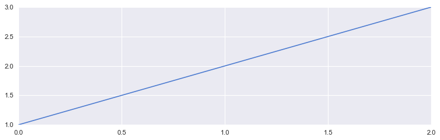


```python
contador += 1
st = lista[contador]
print(st)
fig, ax = plt.subplots(figsize=(10, 3))
plt.style.use(st)
plt.plot([1, 2, 3])
plt.show()
```

```
seaborn-pastel
```


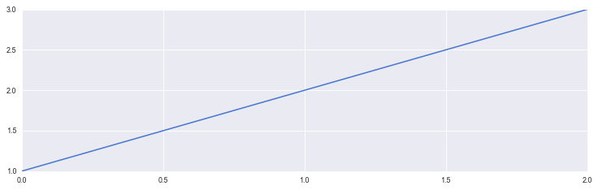


```python
contador += 1
st = lista[contador]
print(st)
fig, ax = plt.subplots(figsize=(10, 3))
plt.style.use(st)
plt.plot([1, 2, 3])
plt.show()
```

```
seaborn-poster
```


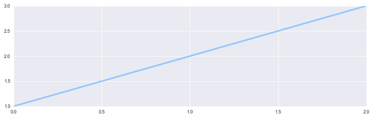


```python
contador += 1
st = lista[contador]
print(st)
fig, ax = plt.subplots(figsize=(10, 3))
plt.style.use(st)
plt.plot([1, 2, 3])
plt.show()
```

```
seaborn-talk
```


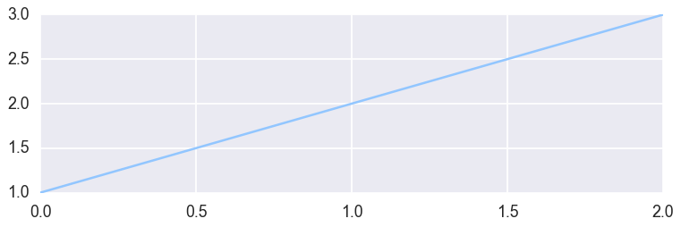


```python
contador += 1
st = lista[contador]
print(st)
fig, ax = plt.subplots(figsize=(10, 3))
plt.style.use(st)
plt.plot([1, 2, 3])
plt.show()
```

```
seaborn-ticks
```


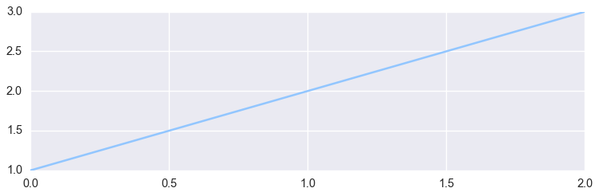


```python
contador += 1
st = lista[contador]
print(st)
fig, ax = plt.subplots(figsize=(10, 3))
plt.style.use(st)
plt.plot([1, 2, 3])
plt.show()
```

```
seaborn-white
```


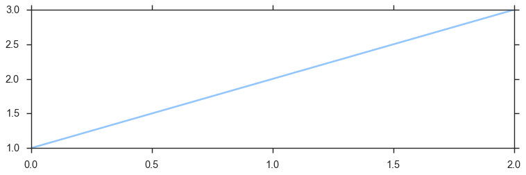


```python
contador += 1
st = lista[contador]
print(st)
fig, ax = plt.subplots(figsize=(10, 3))
plt.style.use(st)
plt.plot([1, 2, 3])
plt.show()
```

```
seaborn-whitegrid
```


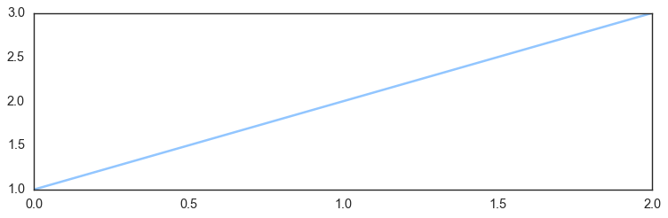


```python
contador += 1
st = lista[contador]
print(st)
fig, ax = plt.subplots(figsize=(10, 3))
plt.style.use(st)
plt.plot([1, 2, 3])
plt.show()
```

```
tableau-colorblind10
```


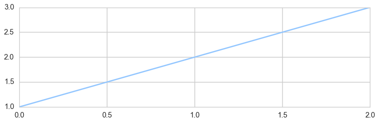

