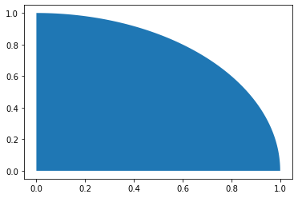
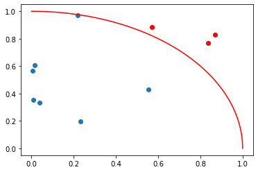
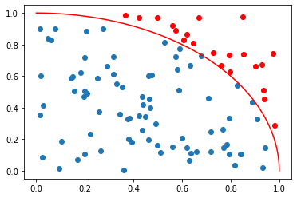
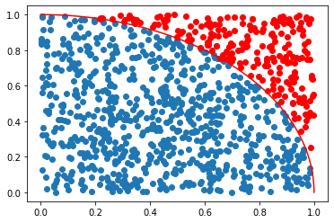
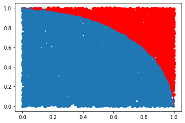
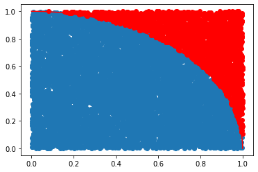
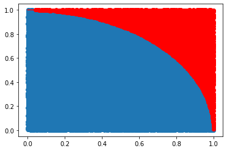

# MONTE CARLO


```python
# IMPORTA MÓDULOS

import numpy as np
import matplotlib.pyplot as plt
```


```python
# VERSÕES 

!python --version
%reload_ext watermark
%watermark --iversions
```

```
Python 3.9.7
numpy     : 1.20.3
matplotlib: 3.4.3

```


```python
def grafico():
    """ FUNÇÃO PARA GERAR GRÁFICO COM LINHA DIVISÓRIA DAS ÁREAS"""
    
    a = np.round(np.linspace(np.pi/2, 0, 100), 8)
    xc = np.cos(a)
    yc = np.sin(a)

    plt.plot(xc, yc, c='r')
```


```python
def sorteador(n):
    """FUNÇÃO PARA SORTEAR NÚMEROS ALEATÓRIOS"""
    
    tb = []
    for _ in range(n):
        tb.append(np.round(np.random.rand(), 8))
        
    return np.array(tb)
```


```python
def pontos(n):
    """FUNÇÃO PARA VERIFICAR SE OS VALORES SORTEADOS ESTÃO DENTRO OU FORA DA ÁREA"""
    
    x = sorteador(n)
    y = sorteador(n)
    
    dentro = []
    fora = []
    
    for a, b in zip(x, y):
        
        hipotenusa = (a ** 2 + b ** 2) ** 0.5
    
        if hipotenusa <= 1:
            dentro.append((a, b))
        else:
            fora.append((a, b))
            
    p = len(dentro) / n
    
    return p, dentro, fora
```


```python
def pi(n):
    """FUNÇÃO PARA ESTIMAR O PI"""
    
    p, d, f = pontos(n)

    d = np.array(d)
    x = d[0:, 0]
    y = d[0:, 1]

    f = np.array(f)
    xf = f[0:, 0]
    yf = f[0:, 1]

    grafico()
    plt.scatter(x, y)
    plt.scatter(xf, yf, c='r')
    
    print('Probabilidade:', p)
    print('PI:', p * 4)
```


```python
# ÁREA DESEJADA PARA ESTIMAR O PI

ai = np.linspace(np.pi / 2, 0, 100)
xci = np.round(np.cos(ai), 8)
yci = np.round(np.sin(ai), 8)

plt.fill_between(xci, yci)
```





# SIMULAÇÃO PARA ESTIMAR O PI


```python
# SIMULAR MONTE CARLO

pi(10)
```

```
Probabilidade: 0.7
PI: 2.8
```





```python
# SIMULAR MONTE CARLO

pi(100)
```

```
Probabilidade: 0.79
PI: 3.16
```





```python
# SIMULAR MONTE CARLO

pi(1000)
```

```
Probabilidade: 0.776
PI: 3.104
```





```python
# SIMULAR MONTE CARLO

pi(10000)
```

```
Probabilidade: 0.7925
PI: 3.17
```





```python
# SIMULAR MONTE CARLO

pi(10000)
```

```
Probabilidade: 0.7837
PI: 3.1348
```





```python
# SIMULAR MONTE CARLO

pi(100000)
```

```
Probabilidade: 0.78434
PI: 3.13736
```




